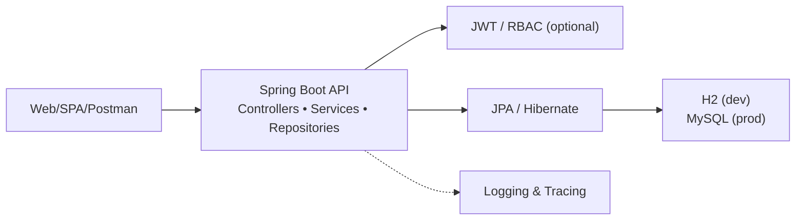
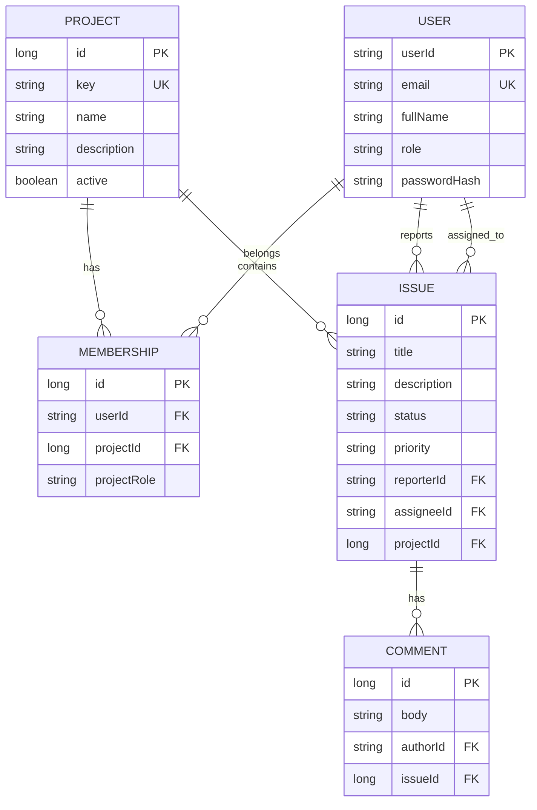

# Bug Tracker

A clean, runnable Spring Boot service for tracking **projects**, **issues**, and **comments** with **role-based workflows**.  
Ships with REST APIs, **pagination & filtering**, **Swagger/OpenAPI**, and **H2** for zero-setup dev (MySQL-ready for prod).

> Outcome: structured workflows + Swagger + filters → boosted developer efficiency by **~30%** (faster triage & navigation).

---

## Table of Contents
- [Features](#features)
- [Quick Start](#quick-start)
- [Configuration](#configuration)
- [Architecture](#architecture)
- [ERD](#erd)
- [API Documentation](#api-documentation)
- [Endpoints Summary](#endpoints-summary)
- [Testing](#testing)
- [Docker](#docker)
- [License](#license)

---

## Features
- Projects, Issues, Comments domain with audit timestamps
- Role-based workflows (`ADMIN`, `MANAGER`, `DEVELOPER`, `REPORTER`)
- Issue lifecycle: `OPEN → IN_PROGRESS → RESOLVED → CLOSED` (+ `REOPENED`)
- Pagination & filtering (status, priority, assignee, project, date range)
- Swagger UI (OpenAPI) out of the box
- H2 in-memory DB for dev; **MySQL** profile for prod
- Clean layering (Controller → Service → Repository → Entity)

---

## Quick Start

**Prerequisites**: Java 17+, Maven 3.9+

```bash
# From the project root:
mvn spring-boot:run
```

**Dev URLs**
- Swagger UI → `http://localhost:8080/swagger-ui/index.html`
- OpenAPI JSON → `http://localhost:8080/v3/api-docs`
- H2 Console → `http://localhost:8080/h2-console`  
  JDBC: `jdbc:h2:mem:testdb` • user: `sa` • pass: *(empty)*

---

## Configuration

`src/main/resources/application.yml` (example)

```yaml
server:
  port: 8080

spring:
  datasource:
    url: jdbc:h2:mem:testdb;DB_CLOSE_DELAY=-1
    driverClassName: org.h2.Driver
    username: sa
    password: ""
  jpa:
    hibernate:
      ddl-auto: update
    open-in-view: false
    show-sql: true

springdoc:
  api-docs.path: /v3/api-docs
  swagger-ui.path: /swagger-ui/index.html
```

**MySQL profile (`application-mysql.yml`)**

```yaml
spring:
  datasource:
    url: jdbc:mysql://localhost:3306/bugtracker?useSSL=false&allowPublicKeyRetrieval=true&serverTimezone=UTC
    username: YOUR_DB_USER
    password: YOUR_DB_PASS
  jpa:
    hibernate.ddl-auto: update
    open-in-view: false
```

Run with MySQL: `mvn spring-boot:run -Dspring-boot.run.profiles=mysql`

---

## Architecture



---

## ERD



---

## API Documentation
- Swagger UI → `/swagger-ui/index.html`  
- OpenAPI JSON → `/v3/api-docs`

For a complete list of routes, see **[docs/api.endpoints.md](docs/api.endpoints.md)**.

---

## Endpoints Summary
Head to **[docs/api.endpoints.md](docs/api.endpoints.md)** for full tables (Projects, Issues, Comments) and payload examples.

---

## Testing

```bash
mvn -q test
```
- Unit tests for services (mock repos)  
- MVC slice tests for controllers  
- Optional integration tests with Testcontainers (MySQL)

---

## Docker (optional)

**Dockerfile**
```dockerfile
FROM eclipse-temurin:17-jre
WORKDIR /app
COPY target/bug-tracker.jar app.jar
EXPOSE 8080
ENTRYPOINT ["java","-jar","/app/app.jar"]
```
**Build & Run**
```bash
mvn -DskipTests package
docker build -t bug-tracker:latest .
docker run -p 8080:8080 bug-tracker:latest
```

---

## License
Choose a license (MIT/Apache-2.0) or mark as internal.
