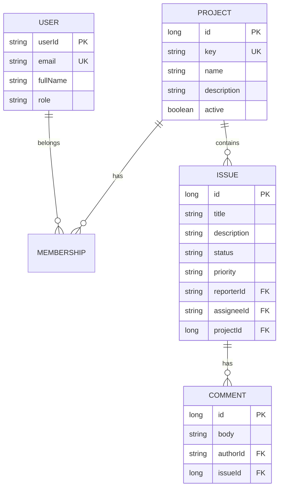
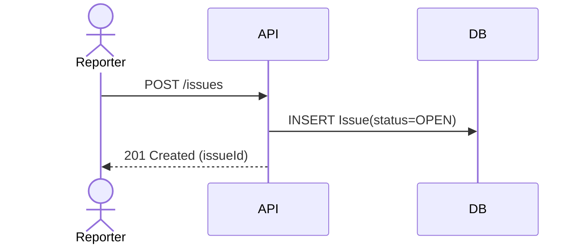
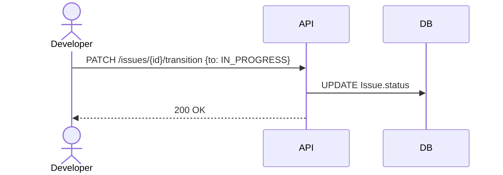

# Bug Tracker — Architecture

**Led design & implementation**

---

## 1) Overview
Spring Boot service for tracking projects and issues with role-based workflows, pagination, and Swagger docs. Dev uses **H2**; prod uses **MySQL**. Optional **JWT/RBAC** can be enabled.

---

## 2) System Context
```mermaid
flowchart LR
  U[Users/Clients] --> FE[SPA / Postman]
  FE --> API["Spring Boot API<br/>Controllers • Services • Repositories"]
  API --> DB[(H2 - dev<br/>MySQL - prod)]
  API --> SEC[JWT / RBAC (optional)]
  API --> OBS[Logging & Tracing]
```
**Notes**
- HTTPS/JSON; stateless API
- Swagger UI for live docs

---

## 3) Backend Architecture
**Layers**
- Controllers → request/response DTOs, validation
- Services → business rules, workflows, transactions
- Repositories → Spring Data JPA
- Entities → JPA domain

**Cross-cutting**
- Exception handling via `@ControllerAdvice`
- Optional JWT filter chain; `@PreAuthorize` on methods
- Structured logging; correlation IDs

---

## 4) Data Model (ERD)


---

## 5) Key Sequences

### 5.1 Create Issue


### 5.2 Transition Issue


---

## 6) Security
- **MVP**: endpoints open for easy demo (permit-all)
- **Optional**: JWT bearer, roles (`ADMIN`, `MANAGER`, `DEVELOPER`, `REPORTER`)
- Method-level guards via `@PreAuthorize`

---

## 7) Deployment & Profiles
- Profiles: `dev` (H2), `mysql` (MySQL)
- Dockerfile for container image; reverse proxy optional

---

## 8) Observability & Ops
- Health: `/actuator/health` (if actuator enabled)
- Logs: JSON with correlation IDs
- Metrics: Micrometer/OpenTelemetry (optional)

---

## 9) Error Handling
- Global handler maps exceptions → consistent error JSON
- Validation via `@Valid` / Bean Validation annotations

---

## 10) Performance & Scalability
- Pagination on list endpoints
- Index common filters (issue status, projectId, assigneeId)
- Stateless API → horizontal scaling

---

## 11) Testing & Quality
- Unit tests (services)
- MVC slice tests (controllers)
- Integration (H2/Testcontainers)
- Static analysis optional

---

## 12) Roadmap
- Attachments, mentions, notifications
- Full-text search
- Reporting dashboards

---

## 13) My Role
Led backend architecture, data modeling, API design, and quality practices.
