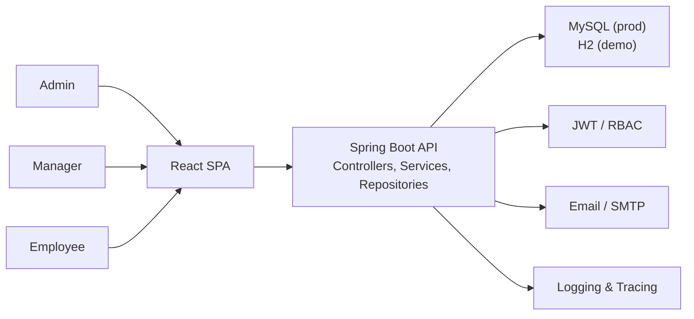
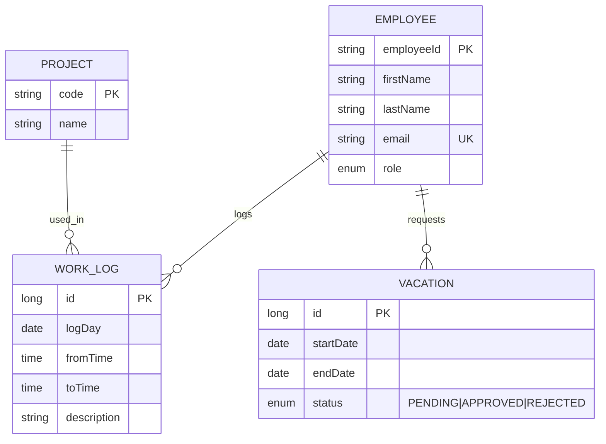
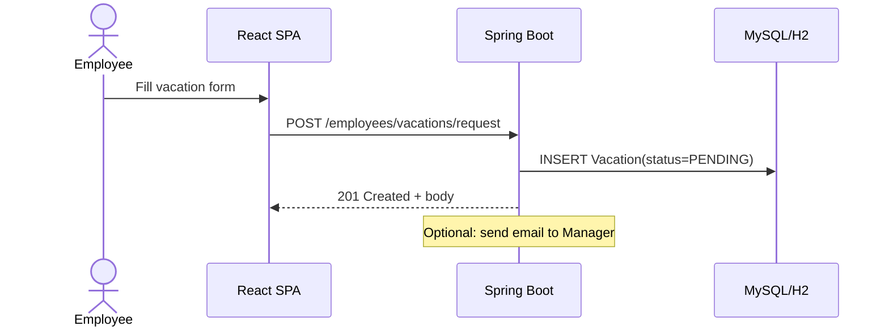

# HR Management System — Architecture (Led design & implementation)

## Overview
This document summarizes the architecture I led for an internal HR platform covering:
- Employees, projects, work logs, vacation workflows
- Role-based access (Admin / Manager / Employee)
- Production on MySQL; demo/dev on H2
- Spring Boot (REST), React SPA, JWT security

---

## System Context

---
## Key choices
- Spring Boot for cohesive web + security + data stack
- JWT + RBAC for stateless auth and role-based authorization
- JPA/Hibernate for persistence + migrations via Flyway (prod)
- React SPA for fast UX; decoupled from backend via REST
  
---

## Backend Architecture

### Layering
- Controllers – REST endpoints; validation; DTO mapping
- Services – business rules; transactions; orchestration
- Repositories – Spring Data JPA; query methods
- Entities – JPA domain model

### Cross-cutting
- Security – filters for JWT; method-level @PreAuthorize
- Exception Handling – global @ControllerAdvice
- Observability – structured logs; request IDs
---
## Security Model
- Auth: JWT bearer tokens (Authorization: Bearer <token>)
- Roles: ADMIN, MANAGER, EMPLOYEE
- Tenancy (optional): X-Tenant-Id header for multi-tenant isolation
---
## Data Model (ERD)

--
## Example Use-Case (Sequence)

--
## Deployment
- Containers: Docker images for API and DB
- DB Migrations: Flyway on app startup (prod)
- Envs: application-{env}.yml with secrets in env vars
- CI/CD: build, test, scan, push image; deploy to env
--
## Outcomes
- Approval cycle cut from days → hours
- Centralized visibility for managers
- Clear separation of concerns → maintainable & testable
